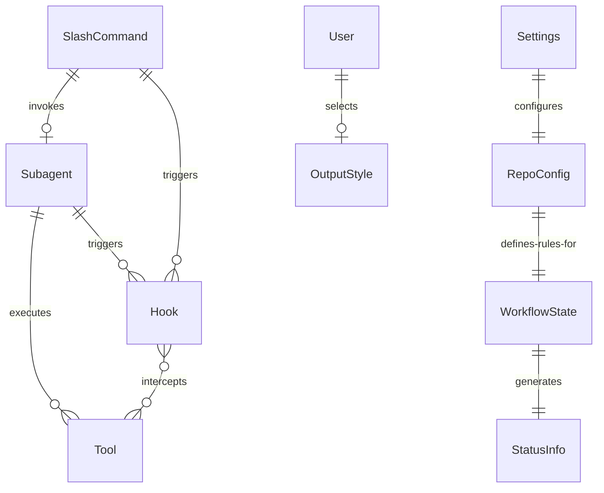

# Data Model: han-solo

**Feature**: han-solo - Agentic Orchestrator
**Date**: 2025-09-18
**Branch**: 001-spec-md

## Overview

The han-solo data model represents the configuration and state entities required for the agentic orchestrator tool. All entities are file-based, stored within the .claude/ directory structure.

## Core Entities

### 1. Command Definition

**Entity**: SlashCommand
**Storage**: `.claude/commands/hansolo/*.md`

| Field | Type | Required | Description | Validation |
|-------|------|----------|-------------|------------|
| name | string | Yes | Command name (filename without .md) | Lowercase, alphanumeric |
| description | string | Yes | YAML frontmatter field | Max 100 characters |
| argument_hint | string | No | YAML frontmatter field | Max 50 characters |
| prompt | markdown | Yes | Command execution instructions | Valid markdown |

**Relationships**:
- Invokes → Subagent (0..1)
- Triggers → Hook (0..n)

### 2. Subagent Configuration

**Entity**: Subagent
**Storage**: `.claude/agents/hansolo/*.md`

| Field | Type | Required | Description | Validation |
|-------|------|----------|-------------|------------|
| name | string | Yes | Agent identifier | Squadron naming pattern |
| description | string | Yes | Agent purpose | Max 200 characters |
| tools | array | Yes | Available tools | Valid tool names |
| system_prompt | markdown | Yes | Agent instructions | Valid markdown |

**Relationships**:
- InvokedBy → SlashCommand (1..n)
- Executes → Tool (0..n)
- Triggers → Hook (0..n)

### 3. Hook Configuration

**Entity**: Hook
**Storage**: `.claude/hooks/*.sh`

| Field | Type | Required | Description | Validation |
|-------|------|----------|-------------|------------|
| name | string | Yes | Script filename | Valid shell script name |
| event | enum | Yes | Hook trigger event | PreToolUse, PostToolUse, Stop |
| tools | array | No | Target tools (if event-specific) | Valid tool names |
| exit_codes | object | Yes | Exit code meanings | 0=success, 2=block |

**Relationships**:
- TriggeredBy → Tool (0..n)
- Intercepts → Subagent (0..n)

### 4. Settings Configuration

**Entity**: Settings
**Storage**: `.claude/settings.json`

| Field | Type | Required | Description | Validation |
|-------|------|----------|-------------|------------|
| hooks | object | Yes | Hook configurations | Valid JSON |
| status_line | string | No | Status line script path | Valid file path |
| output_styles | array | No | Available output styles | Valid style names |

**State**: Singleton (one per project)

### 5. Repository Configuration

**Entity**: RepoConfig
**Storage**: Various root-level files

| Field | Type | Required | Description | Validation |
|-------|------|----------|-------------|------------|
| gitignore | file | Yes | .gitignore | Valid gitignore syntax |
| gitconfig | file | Yes | .gitconfig | Valid git config |
| gitmessage | file | Yes | .gitmessage | Valid template |
| pr_template | file | Yes | .github/pull_request_template.md | Valid markdown |
| claude_md | file | Yes | CLAUDE.md | Valid markdown |

**State Transitions**:
- Uninitialized → Initialized (via /hansolo:init)
- Initialized → Configured (via branch protection setup)

### 6. Workflow State

**Entity**: WorkflowState
**Storage**: Runtime (not persisted)

| Field | Type | Required | Description | Validation |
|-------|------|----------|-------------|------------|
| current_branch | string | Yes | Active Git branch | Valid branch name |
| pr_number | number | No | Active PR if exists | Positive integer |
| ci_status | enum | No | CI pipeline status | pending, running, passed, failed |
| context_usage | percent | Yes | Context window usage | 0-100 |
| checkpoint_count | number | Yes | Uncommitted checkpoints | Non-negative integer |

**State Transitions**:
- main → feature/* (via /hansolo:launch)
- feature/* → pr_open (via /hansolo:ship)
- pr_open → merged (via GitHub)
- merged → main (via auto-sync)

### 7. Status Line Data

**Entity**: StatusInfo
**Storage**: Runtime (computed)

| Field | Type | Required | Description | Validation |
|-------|------|----------|-------------|------------|
| project_name | string | Yes | Project folder name | Valid directory name |
| model | string | Yes | Active Claude model | Valid model ID |
| branch | string | Yes | Current Git branch | Valid branch name |
| pr_status | object | No | PR checks status | Valid status object |
| warnings | array | No | Active warnings | Warning objects |

**Computed From**:
- Git status commands
- GitHub CLI queries
- Session transcript analysis

### 8. Output Style

**Entity**: OutputStyle
**Storage**: `.claude/output-styles/*.md`

| Field | Type | Required | Description | Validation |
|-------|------|----------|-------------|------------|
| name | string | Yes | Style identifier | Valid filename |
| description | string | Yes | Style purpose | Max 200 characters |
| system_prompt | markdown | Yes | Replacement prompt | Valid markdown |
| tone | enum | Yes | Communication style | strict, tutor |

**Relationships**:
- SelectedBy → User (via /output-style command)

## Entity Relationships

## Validation Rules

### Command Validation
- Command names must be lowercase alphanumeric with hyphens
- Commands under /hansolo: namespace must exist in .claude/commands/hansolo/
- YAML frontmatter must be valid and complete

### Hook Validation
- Shell scripts must be executable (755 permissions)
- Must handle JSON input via stdin
- Must output to stderr for Claude feedback
- Exit codes must be 0 (success), 1 (warning), or 2 (block)

### Configuration Validation
- All JSON files must be valid JSON
- All markdown files must be valid markdown
- File paths must be relative to project root or absolute

### State Validation
- Only one feature branch active at a time
- Cannot ship from main branch
- Cannot have uncommitted checkpoints when shipping
- PR must pass checks before merge

## Data Flow

1. **Command Invocation**:
   - User types /hansolo:command
   - Claude reads command definition
   - Command invokes subagent
   - Subagent executes tools
   - Hooks intercept tool execution
   - Results returned to user

2. **Status Updates**:
   - Status line script runs periodically
   - Reads Git state and GitHub status
   - Computes warnings and alerts
   - Updates status line display

3. **Configuration Changes**:
   - Init command creates config files
   - Settings updated via file writes
   - Hooks registered in settings.json
   - Changes take effect immediately

## Persistence Strategy

### File-Based Storage
- All configuration stored as files
- Version controlled with Git
- Portable across machines
- Human-readable formats

### Runtime State
- Workflow state computed on demand
- No persistent state database
- Status derived from Git/GitHub

### Backup Strategy
- Configuration files in version control
- Checkpoint commits provide history
- GitHub stores PR and CI state

---
*Data model defined: 2025-09-18*
*Optimized for file-based storage and Git integration*